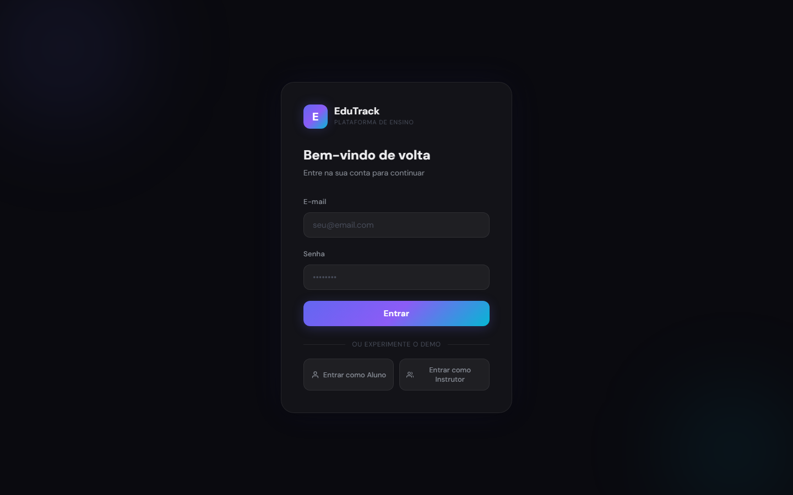
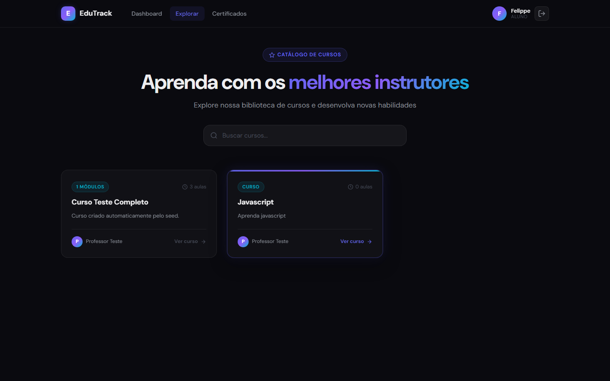
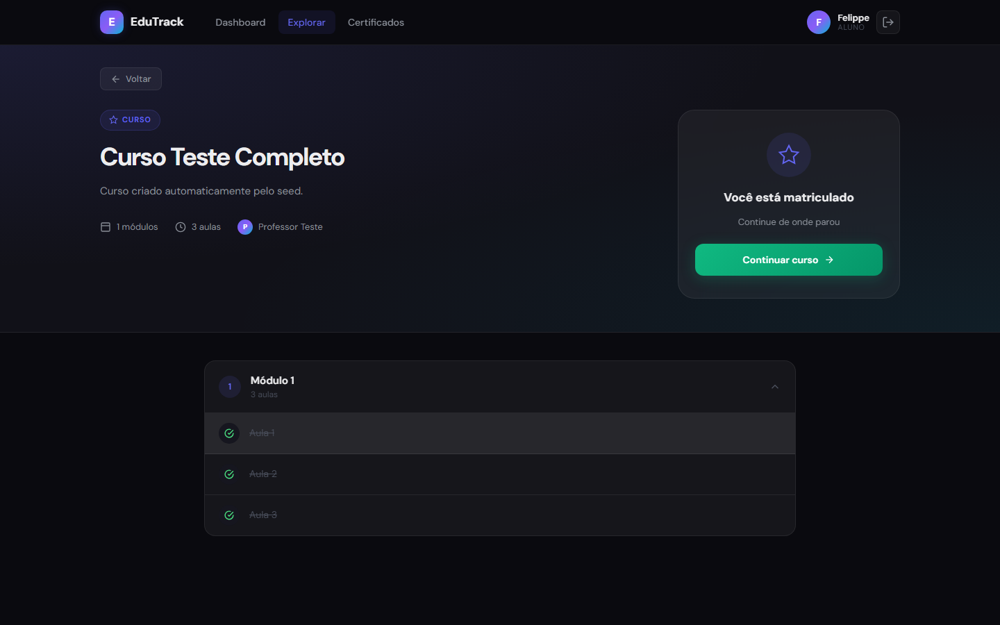
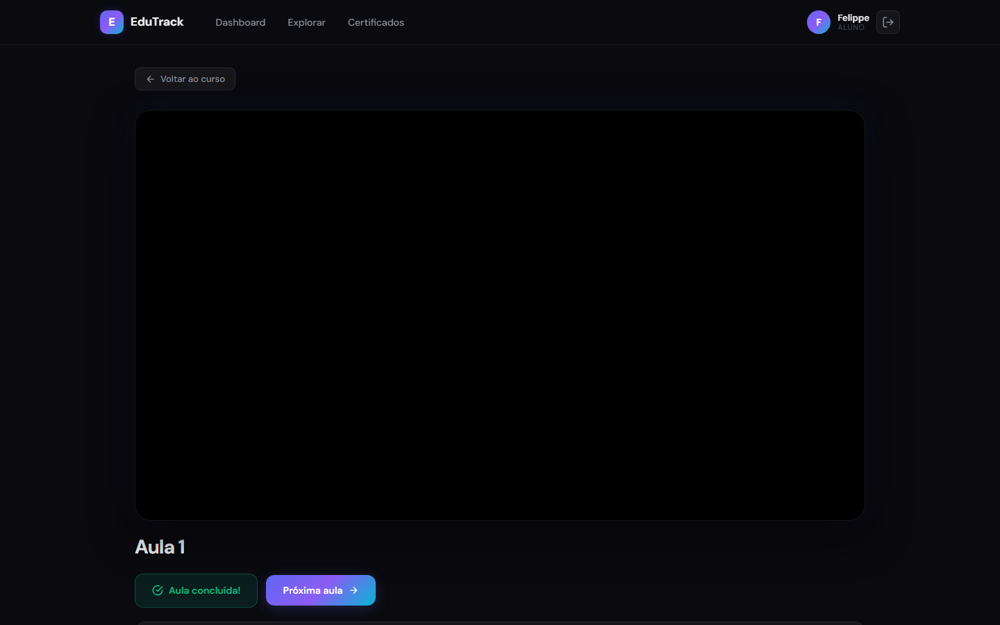
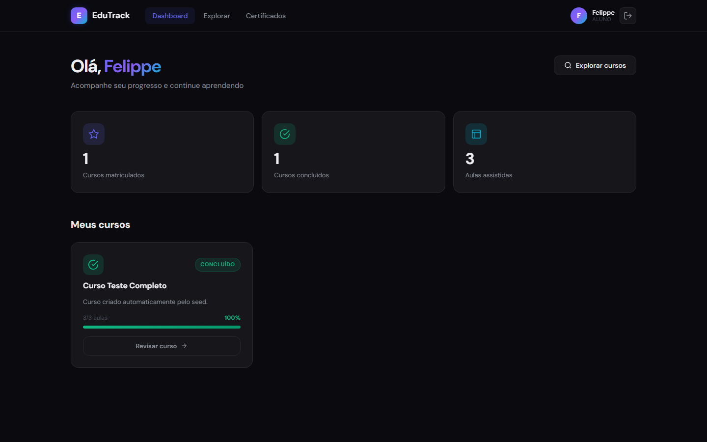
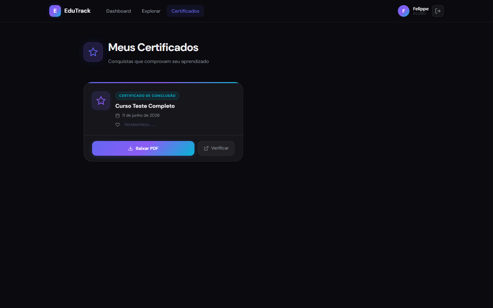
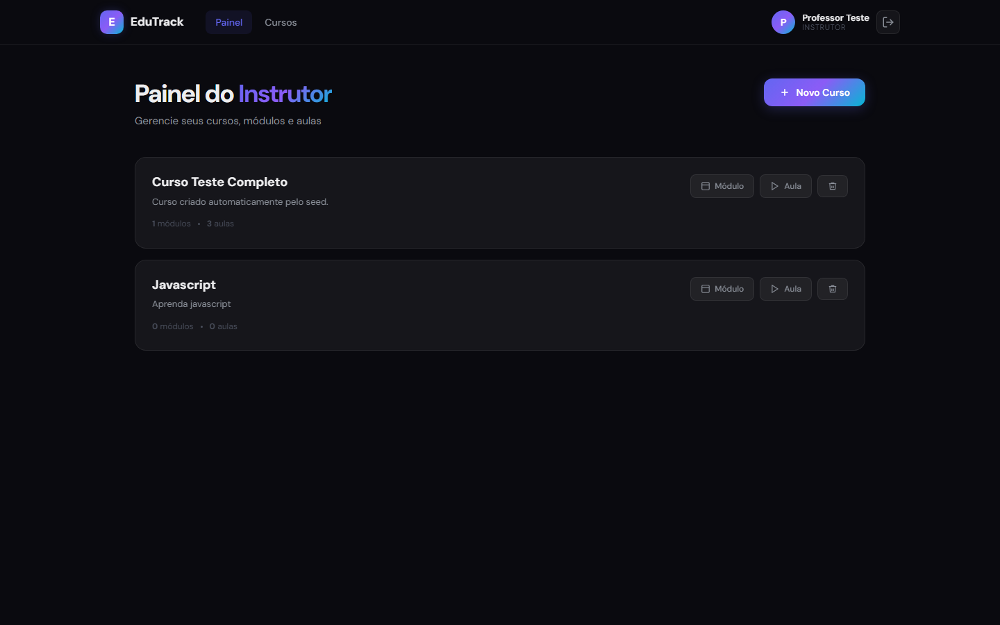
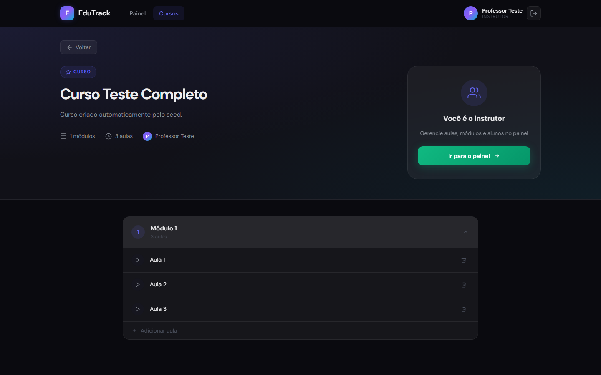

# EduTrack

A learning management system (LMS) built with Node.js, Express, React, and MySQL. Students can enroll in courses, watch video lessons, track progress, and earn certificates with QR codes. Instructors manage courses, modules, and lessons through a dedicated panel and directly from the course detail page. Admins have full user management and platform statistics!

**Live demo:** [edu-track-blond-eta.vercel.app](https://edu-track-blond-eta.vercel.app)

---

## Table of Contents

- [Tech Stack](#tech-stack)
- [Architecture Overview](#architecture-overview)
- [Features](#features)
- [Demo Access](#demo-access)
- [Screenshots](#screenshots)
- [Database Schema](#database-schema)
- [API Reference](#api-reference)
- [Project Structure](#project-structure)
- [Getting Started](#getting-started)
- [Environment Variables](#environment-variables)
- [Deployment](#deployment)
- [Roles and Permissions](#roles-and-permissions)
- [Seed Data](#seed-data)
- [Certificate Generation](#certificate-generation)

---

## Tech Stack

**Backend**
- Node.js + Express + TypeScript
- Prisma ORM with MySQL
- JWT authentication (jsonwebtoken)
- Password hashing (bcryptjs)
- PDF generation via Playwright (headless Chromium) + QR codes (qrcode)
- Schema validation (Zod)

**Frontend**
- React 19 + TypeScript (Create React App)
- React Router DOM v7
- Axios for HTTP
- CSS Modules — one `.module.css` per component
- Custom dark glassmorphism design system

---

## Architecture Overview

```
edu-track-1/
├── backend/    Express API — deployed on Railway
└── frontend/   React app — deployed on Vercel
```

In production, the Vercel frontend proxies all `/api/*` requests to the Railway backend (server-to-server), avoiding browser CORS issues entirely. Locally, the frontend talks directly to `localhost:3001`.

Authentication uses JWT tokens stored in `localStorage`. The token is attached automatically to every request via an Axios interceptor.

---

## Features

### Student
- Browse the course catalog
- Enroll in courses with one click
- Watch video lessons (YouTube and Vimeo embeds)
- Mark lessons as completed — status persists across page reloads
- Visual completion checkmarks on the course syllabus
- "Próxima aula" button appears after completing a lesson for seamless navigation
- View per-course progress
- Certificates automatically issued upon 100% course completion
- Download PDF certificates with QR codes
- Share public certificate verification links

### Instructor
- Create, view, and delete courses
- Add modules to courses via the instructor panel
- Add and remove video lessons directly from the course detail page
- Instructor card shown instead of enrollment card when viewing own courses
- View only courses they own

### Admin
- All student and instructor capabilities
- List all platform users
- Change user roles
- Delete user accounts
- View platform statistics (total users, courses, enrollments, lessons completed)

---

## Demo Access

The login page includes one-click demo buttons — no registration needed:

| Role | Email | Password |
|------|-------|----------|
| INSTRUCTOR | prof@example.com | 123456 |
| STUDENT | felippe@example.com | 123456 |

The student account comes pre-enrolled in the sample course with full progress and an issued certificate.

---

## Screenshots

### Login


### Catálogo de Cursos


### Detalhe do Curso — Visão do Aluno
> Aulas com checkmarks indicando conclusão


### Player de Aula
> Botão "Próxima aula" aparece após concluir a aula atual


### Dashboard do Aluno


### Certificados
> Emissão automática ao atingir 100% do curso; download em PDF com QR Code


### Painel do Instrutor


### Detalhe do Curso — Visão do Instrutor
> Instrutor vê controles de gerenciamento de aulas em vez do card de matrícula


---

## Database Schema

```
User
  id, name, email, password, role (STUDENT | INSTRUCTOR | ADMIN)

Course
  id, title, description, instructorId → User

Module
  id, title, courseId → Course

Lesson
  id, title, content, videoUrl, courseId → Course, moduleId → Module (optional)

Enrollment
  id, userId → User, courseId → Course

LessonProgress
  id, userId → User, lessonId → Lesson, completedAt

Certificate
  id, userId → User, courseId → Course, issuedAt, code (unique)
```

Lessons can belong to a module or sit directly on a course (loose lessons). Certificates carry a unique verification code used in public URLs.

---

## API Reference

All protected routes require the header:
```
Authorization: Bearer <token>
```

### Auth

| Method | Route | Auth | Description |
|--------|-------|------|-------------|
| POST | `/auth/register` | — | Register new user |
| POST | `/auth/login` | — | Login, returns JWT + user |

### Courses

| Method | Route | Auth | Description |
|--------|-------|------|-------------|
| GET | `/courses` | Required | List all courses |
| GET | `/courses/:id` | Required | Course detail with modules and lessons |
| POST | `/courses` | INSTRUCTOR | Create course |
| PUT | `/courses/:id` | INSTRUCTOR | Update course |
| DELETE | `/courses/:id` | INSTRUCTOR | Delete course |

### Modules

| Method | Route | Auth | Description |
|--------|-------|------|-------------|
| GET | `/modules/course/:courseId` | Required | List modules for a course |
| POST | `/modules` | INSTRUCTOR | Create module |
| PUT | `/modules/:id` | INSTRUCTOR | Update module |
| DELETE | `/modules/:id` | INSTRUCTOR | Delete module |

### Lessons

| Method | Route | Auth | Description |
|--------|-------|------|-------------|
| GET | `/lessons/module/:moduleId` | Required | Lessons in a module |
| GET | `/lessons/:id` | Required | Single lesson |
| POST | `/lessons` | INSTRUCTOR | Create lesson |
| PUT | `/lessons/:id` | INSTRUCTOR | Update lesson |
| DELETE | `/lessons/:id` | INSTRUCTOR | Delete lesson |

### Enrollments

| Method | Route | Auth | Description |
|--------|-------|------|-------------|
| POST | `/enrollments` | STUDENT | Enroll in a course |
| GET | `/enrollments/user/:userId` | Required | User's enrollments |
| GET | `/enrollments/course/:courseId` | Required | Course enrollments |

### Progress

| Method | Route | Auth | Description |
|--------|-------|------|-------------|
| POST | `/progress/complete` | STUDENT | Mark lesson as complete (idempotent) |
| GET | `/progress/course/:courseId` | STUDENT | Course progress + completed lesson IDs |
| GET | `/progress/lesson/:lessonId` | STUDENT | Check if a specific lesson is completed |

### Certificates

| Method | Route | Auth | Description |
|--------|-------|------|-------------|
| GET | `/certificates` | Required | List user's certificates |
| POST | `/certificates/issue/:courseId` | STUDENT | Issue certificate if course is 100% complete |
| GET | `/certificates/pdf/:certificateId` | Required | Download certificate as PDF |
| GET | `/certificates/public/:code` | — | Public PDF download via verification code |

### Admin

| Method | Route | Auth | Description |
|--------|-------|------|-------------|
| GET | `/admin/users` | ADMIN | List all users |
| PATCH | `/admin/users/:id/role` | ADMIN | Change user role |
| DELETE | `/admin/users/:id` | ADMIN | Delete user |
| GET | `/admin/stats` | ADMIN | Platform statistics |

---

## Project Structure

```
backend/
├── prisma/
│   ├── schema.prisma          Database schema
│   └── migrations/            Migration history
├── src/
│   ├── server.ts              Express app entry, route registration, CORS
│   ├── lib/prisma.ts          Prisma client singleton
│   ├── config/prismaClient.ts Alternative Prisma client
│   ├── auth/                  JWT auth, middleware, role guard
│   ├── courses/               Course CRUD
│   ├── modules/               Module CRUD
│   ├── lessons/               Lesson CRUD
│   ├── enrollment/            Enrollment logic
│   ├── progress/              Lesson progress tracking
│   ├── certificate/           Certificate issuance, PDF generation (Playwright + QR)
│   ├── admin/                 Admin-only user management
│   └── prisma/seed.ts         Database seed script
└── .env                       Environment variables (not committed)

frontend/
├── public/
│   └── index.html
└── src/
    ├── index.tsx              CRA entry point
    ├── App.tsx                AuthProvider + AppRoutes
    ├── index.css              Global design system (CSS variables, utilities)
    ├── api/axios.ts           Axios instance with auth interceptor + env-aware base URL
    ├── contexts/
    │   └── AuthContext.tsx    Global auth state, localStorage persistence
    ├── components/
    │   ├── Navbar.tsx         Role-aware top navigation
    │   └── PrivateRoute.tsx   Route guard with role-based access
    ├── routes/
    │   └── AppRoutes.tsx      All routes with role restrictions
    └── pages/
        ├── Login.tsx          Login form + one-click demo buttons
        ├── Courses.tsx        Course catalog
        ├── CourseDetail.tsx   Course page with syllabus, enrollment, and instructor lesson management
        ├── LessonPlayer.tsx   Video embed, progress marking, next lesson navigation
        ├── Dashboard.tsx      Student progress overview
        ├── Certificates.tsx   Auto-issue + certificate list + PDF download
        └── InstructorPanel.tsx  Course/module/lesson management panel
```

---

## Getting Started

### Prerequisites

- Node.js 18+
- MySQL 8+ running locally on port 3306
- A database named `edutrack` created in MySQL

```sql
CREATE DATABASE edutrack;
```

### 1. Clone the repository

```bash
git clone https://github.com/felippeximenes/edu-track.git
cd edu-track-1
```

### 2. Backend setup

```bash
cd backend
npm install
```

Create the `.env` file (see [Environment Variables](#environment-variables)), then run:

```bash
npx prisma generate
npx prisma migrate deploy
npx playwright install chromium
npm run seed
npm run dev
```

The API will be available at `http://localhost:3001`.

### 3. Frontend setup

Open a second terminal:

```bash
cd frontend
npm install
npm start
```

The app will open at `http://localhost:3000`.

---

## Environment Variables

Create `backend/.env` with the following:

```env
DATABASE_URL="mysql://root:<password>@localhost:3306/edutrack"
JWT_SECRET="your-secret-key"
APP_URL="http://localhost:3001"
PORT=3001
```

---

## Deployment

The project is deployed with a split hosting setup:

| Layer | Platform | Notes |
|-------|----------|-------|
| Frontend | Vercel | Auto-deploys from `feat/backend-setup` branch |
| Backend | Railway | Nixpacks build, `PORT` injected by Railway at runtime |
| Database | Railway MySQL | Managed MySQL instance |

**Vercel proxy:** `vercel.json` rewrites `/api/*` to the Railway backend URL. This means all API calls from the browser go through Vercel's servers (no CORS preflight required).

**Railway:** The backend binds to `0.0.0.0` using the `PORT` environment variable provided by Railway. The Railway Networking section must be configured to match this port.

---

## Roles and Permissions

| Feature | STUDENT | INSTRUCTOR | ADMIN |
|---------|---------|------------|-------|
| Browse courses | Yes | Yes | Yes |
| Enroll in courses | Yes | — | Yes |
| Watch lessons | Yes (enrolled) | — | Yes |
| Mark progress | Yes | — | Yes |
| Download certificates | Yes | — | Yes |
| Create/manage courses | — | Yes (own) | Yes |
| Add/remove lessons in course detail | — | Yes (own) | Yes |
| Manage all users | — | — | Yes |
| View platform stats | — | — | Yes |

Role-based access is enforced on both the API (Express middleware) and the frontend (protected routes with role checks).

---

## Seed Data

Running `npm run seed` from the `backend` directory wipes all existing data and creates:

| Role | Email | Password |
|------|-------|----------|
| INSTRUCTOR | prof@example.com | 123456 |
| STUDENT | felippe@example.com | 123456 |

It also creates one sample course with one module, three lessons, full progress for the student (100%), and an enrollment. After seeding, log out and back in to refresh the JWT with the new user IDs.

---

## Certificate Generation

Certificates are generated as PDF files using Playwright (headless Chromium). Each certificate includes:

- Student name and course title
- Issue date
- A unique verification code
- A QR code linking to the public verification URL (`/certificates/public/:code`)

Certificates are **automatically issued** when the student visits the Certificates page and has 100% progress in any enrolled course. The check uses distinct completed lesson IDs to avoid false negatives from duplicate progress records.

Playwright's Chromium browser must be installed separately:

```bash
cd backend
npx playwright install chromium
```
